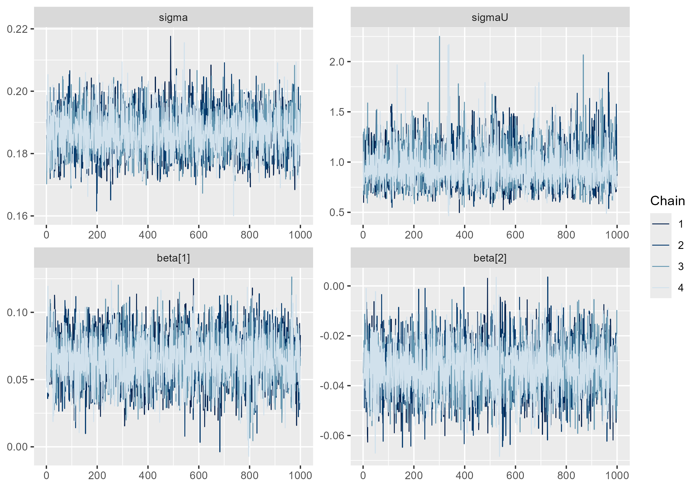

# Diagnóstico y Validación de los Modelos de Población {#cap-diagnostico}

El Capítulo \@ref(cap-inferencia) estableció el procedimiento de estimación de los modelos de población mediante HMC-NUTS. En este capítulo se evalúa si las estimaciones obtenidas son estadísticamente confiables y si el modelo representa adecuadamente la población en las áreas o segmentos de interés, particularmente cuando la información censal es incompleta o presenta problemas de cobertura.

La validación comprende tres componentes. El primero corresponde al diagnóstico de convergencia y eficiencia de las cadenas MCMC. El segundo evalúa, mediante la distribución predictiva posterior, la capacidad del modelo para reproducir los conteos y tamaños de población observados. El tercero comprende la comparación de especificaciones alternativas, con el fin de identificar aquellas que presentan un mejor ajuste y comportamiento predictivo.

De manera complementaria, podrá considerarse la comparación de las estimaciones con ejercicios demográficos o estimaciones de población previamente disponibles. Este contraste permitiría evaluar la coherencia de los resultados con otras aproximaciones de estimación, especialmente en contextos donde no existen observaciones censales completas para realizar una validación directa.

En conjunto, estos elementos permiten establecer criterios para determinar la suficiencia del modelo, identificar posibles problemas de especificación y sustentar el uso de las estimaciones de población en áreas afectadas por limitaciones del operativo censal.


## Diagnóstico de convergencia MCMC

El diagnóstico de convergencia es la primera verificación que debe realizarse sobre cualquier ajuste MCMC, con prioridad sobre cualquier interpretación sustantiva de los parámetros. Si las cadenas no han convergido a la distribución posterior estacionaria, las muestras no son representativas de $p(\boldsymbol{\theta}, \boldsymbol{\delta} \mid \mathbf{Y}_{obs})$ y cualquier estimación puntual, intervalo de credibilidad o criterio de comparación de modelos calculado a partir de ellas carece de validez.

### Estadístico R-hat {#estadistico-rhat}

El estadístico $\hat{R}$, propuesto por @Gelman1992, evalúa la convergencia de las cadenas comparando la variabilidad entre cadenas con la variabilidad dentro de cada cadena. Sea $\theta_{t,c}$ la muestra $t$ de la cadena $c$, con $t = 1, \ldots, n$ y $c = 1, \ldots, m$ —el índice $c$ de cadena no debe confundirse con el índice $j$ de unidad territorial introducido en el Capítulo \@ref(cap-conteos)—, después de descartar el período de calentamiento. La varianza promedio dentro de las cadenas se calcula como:

$$
W = \frac{1}{m} \sum_{c=1}^{m} s_c^2, \qquad s_c^2 = \frac{1}{n-1}\sum_{t=1}^{n}\left(\theta_{t,c} - \bar{\theta}_{\cdot c}\right)^2
$$

donde $\bar{\theta}_{\cdot c}$ es la media de la cadena $c$. La varianza entre cadenas se calcula como:

$$
B = \frac{n}{m-1}\sum_{c=1}^{m}\left(\bar{\theta}_{\cdot c} - \bar{\theta}_{\cdot \cdot}\right)^2
$$

donde $\bar{\theta}_{\cdot \cdot} = \frac{1}{m}\sum_c \bar{\theta}_{\cdot c}$ es la media global. La varianza marginal posterior se estima combinando ambas fuentes:

$$
\hat{V} = \frac{n-1}{n}W + \frac{1}{n}B
$$

y el estadístico de convergencia se define como:

$$
\hat{R} = \sqrt{\frac{\hat{V}}{W}}
$$

Cuando las cadenas han convergido a la misma distribución estacionaria, $\hat{V}$ y $W$ estiman la misma cantidad y $\hat{R} \to 1$. Valores de $\hat{R}$ sustancialmente mayores que 1 indican que las cadenas todavía exploran regiones distintas del espacio parametral y que se requieren más iteraciones, una reparametrización del modelo o una revisión de las distribuciones a priori.

La versión clásica de $\hat{R}$ presenta limitaciones cuando las distribuciones posteriores tienen colas pesadas o varianzas no finitas, ya que la comparación basada en momentos puede perder sensibilidad ante problemas de convergencia. @Vehtari2021 propone una versión mejorada basada en la normalización por rangos (*rank-normalized $\hat{R}$*) y el plegamiento (*folded $\hat{R}$*). Esta estrategia permite evaluar por separado la convergencia de la localización y de la escala de la distribución, y reporta como diagnóstico el mayor de ambos valores. La versión resultante es la utilizada actualmente por Stan y por el paquete `posterior`.

El valor $\hat{R}=1$ corresponde a una convergencia ideal entre las cadenas. Aunque el umbral de $1.1$ fue utilizado tradicionalmente, @Vehtari2021 recomienda adoptar un criterio más estricto de $\hat{R}<1.01$. Este valor es también el umbral recomendado actualmente en la documentación de Stan para considerar confiables las muestras posteriores.

En los modelos de población considerados en este libro, el criterio debe verificarse para la totalidad de los parámetros monitoreados, incluyendo tanto los parámetros estructurales como las densidades latentes $\delta_i$. No basta con comprobar la convergencia de $\boldsymbol{\beta}$, $\boldsymbol{\gamma}$, $\sigma$ y $\sigma_U$, ya que problemas de convergencia en las cantidades latentes pueden afectar directamente las estimaciones de población en los dominios de interés.

### Tamaño efectivo de muestra (ESS) {#tamano-efectivo-muestra}

Las muestras generadas por una cadena de Markov presentan autocorrelación, por lo que no contienen la misma información que un conjunto equivalente de muestras independientes. El tamaño efectivo de muestra (*Effective Sample Size*, ESS) cuantifica cuántas observaciones independientes serían necesarias para alcanzar una precisión de Monte Carlo equivalente. Para una cantidad escalar $\theta$, se define como:

$$
n_{\mathrm{eff}} =
\frac{mn}
{1 + 2\sum_{t=1}^{\infty}\hat{\rho}_t},
$$

donde $mn$ es el número total de muestras posteriores y $\hat{\rho}_t$ representa la autocorrelación estimada en el retraso $t$. Una mayor autocorrelación implica un menor ESS y, por tanto, una mayor incertidumbre asociada al error de Monte Carlo.

@Vehtari2021 distinguen dos medidas complementarias: el *Bulk-ESS*, que evalúa la eficiencia de muestreo en la región central de la distribución posterior, y el *Tail-ESS*, que evalúa su eficiencia en las colas. Esta distinción es particularmente importante para los intervalos de credibilidad, cuyos límites dependen de los cuantiles de la distribución posterior. Un modelo puede presentar un Bulk-ESS adecuado y, simultáneamente, un Tail-ESS insuficiente.

Como criterio práctico, se recomienda disponer de al menos 400 muestras efectivas tanto para Bulk-ESS como para Tail-ESS por cada cantidad de interés. Cuando este criterio no se cumple, puede ser necesario aumentar el número de iteraciones posteriores al calentamiento, revisar la parametrización del modelo o evaluar posibles problemas de identificación.

En los modelos de población, este diagnóstico debe evaluarse tanto para los parámetros estructurales como para las cantidades latentes que intervienen directamente en las estimaciones de población.

### Trace plots, autocorrelación y diagnósticos específicos de HMC

La inspección visual de las cadenas complementa los diagnósticos numéricos y permite identificar patrones de no convergencia o mezcla deficiente. El *trace plot* representa los valores muestreados de un parámetro a lo largo de las iteraciones para las distintas cadenas. Un comportamiento adecuado se caracteriza por cadenas que oscilan alrededor de una distribución común, sin tendencias sistemáticas, períodos prolongados de estancamiento o separación persistente entre cadenas. Este patrón suele describirse informalmente como *fat hairy caterpillar*. La Figura \@ref(fig:trace-hmc) muestra este comportamiento para los parámetros $\sigma$, $\sigma_U$, $\beta_1$ y $\beta_2$ en un ajuste real del modelo Poisson-lognormal, del mismo tipo que el presentado en la aplicación del Capítulo \@ref(cap-inferencia) —por confidencialidad, no se identifica el país de procedencia de los datos—.

```{r trace-hmc, echo=FALSE, fig.cap="Trace plot de $\\sigma$, $\\sigma_U$, $\\beta_1$ y $\\beta_2$ sobre las cuatro cadenas.", out.width="70%", fig.align='center'}

```

La autocorrelación evalúa la dependencia entre muestras separadas por distintos retrasos (*lags*). Una disminución rápida de la autocorrelación hacia cero indica una mezcla eficiente, mientras que valores elevados durante numerosos retrasos señalan una fuerte dependencia entre muestras y, por tanto, un ESS reducido.

Los algoritmos HMC-NUTS incorporan además diagnósticos específicos de su dinámica. Las **transiciones divergentes** indican que el integrador numérico no ha podido resolver adecuadamente la dinámica hamiltoniana en determinadas regiones de la distribución posterior [@Betancourt2017]. Su presencia puede comprometer la validez de las estimaciones y requiere revisar la parametrización del modelo, pudiendo ser necesario incrementar `adapt_delta` o adoptar una parametrización alternativa.

Otro diagnóstico es el **E-BFMI** (*Energy Bayesian Fraction of Missing Information*), que evalúa la eficiencia con la que las cadenas exploran la distribución de energía del sistema hamiltoniano. Valores inferiores a 0.2 sugieren una exploración deficiente y requieren atención, incluso cuando otros diagnósticos, como $\hat{R}$, no presentan problemas [@Betancourt2017].

En conjunto, los *trace plots*, la autocorrelación, las divergencias y el E-BFMI complementan $\hat{R}$ y ESS. Ningún diagnóstico aislado garantiza la convergencia; la evaluación debe considerar conjuntamente la evidencia proporcionada por todos ellos antes de utilizar las distribuciones posteriores para obtener estimaciones de población.


## Validación predictiva posterior

Un modelo puede satisfacer todos los diagnósticos de convergencia y, sin embargo, ser inadecuado para describir los datos observados. La validación predictiva posterior evalúa esta segunda dimensión: la capacidad del modelo ajustado para generar datos simulados que se asemejen a los datos reales.

### Posterior predictive checks (PPC)

La verificación predictiva posterior (*Posterior Predictive Checks*, PPC) evalúa si el modelo es capaz de reproducir características relevantes de los datos observados [@Gelman2013]. Para ello, se generan réplicas $\mathbf{Y}^{rep}$ a partir de la distribución predictiva posterior:

$$
p(\mathbf{Y}^{rep} \mid \mathbf{Y}_{obs}) =
\int p(\mathbf{Y}^{rep} \mid \boldsymbol{\theta})
p(\boldsymbol{\theta} \mid \mathbf{Y}_{obs})d\boldsymbol{\theta}.
$$

La comparación puede realizarse mediante una función de prueba $T(\cdot)$ que represente alguna característica relevante de los conteos, como la media, la desviación estándar, la proporción de ceros o determinados cuantiles. La discrepancia entre los valores observados y los obtenidos en las réplicas permite identificar dimensiones en las que el modelo no reproduce adecuadamente los datos.

En los modelos de población, los PPC deben considerar tanto el comportamiento global como posibles diferencias entre tipos de segmentos. Por ejemplo, resulta relevante evaluar por separado segmentos urbanos y rurales o grupos definidos según sus características de cobertura. Un modelo puede reproducir adecuadamente la distribución agregada de los conteos y, al mismo tiempo, presentar deficiencias sistemáticas en determinados grupos de segmentos.

Por tanto, los PPC constituyen una herramienta para identificar deficiencias en la distribución predictiva del modelo y orientar la revisión de su especificación. La evaluación no debe limitarse a un único estadístico, sino considerar varias características de los conteos que sean relevantes para la estimación de población.

### Residuos bayesianos

El análisis de residuos permite identificar segmentos cuyo conteo observado presenta una discrepancia importante respecto de la distribución predictiva del modelo. A diferencia de los residuos de Pearson utilizados en el diagnóstico exploratorio del Capítulo \@ref(cap-insumos), los residuos bayesianos [@Chaloner1988] incorporan la incertidumbre asociada a la predicción posterior. Para el segmento $i$, puede definirse el residuo predictivo estandarizado como:

$$
r_i =
\frac{
Y_i-\mathbb{E}[\tilde{Y}_i\mid\mathbf{Y}_{obs}]
}{
\sqrt{\operatorname{Var}(\tilde{Y}_i\mid\mathbf{Y}_{obs})}
},
$$

donde la media y la varianza predictivas se obtienen a partir de las réplicas posteriores de $\tilde{Y}_i$.

Valores absolutos elevados de $r_i$ indican segmentos en los que el conteo observado se encuentra alejado del comportamiento esperado bajo el modelo. Sin embargo, estos valores deben interpretarse como indicadores de discrepancia y no como pruebas formales de atipicidad, particularmente porque la distribución predictiva de los conteos puede ser asimétrica.

En los modelos de población, resulta especialmente relevante examinar la distribución de estos residuos según características territoriales y operativas. Una concentración sistemática de residuos positivos o negativos en determinados tipos de segmentos puede indicar que el modelo no está capturando adecuadamente alguna fuente de heterogeneidad, lo que puede motivar la incorporación de covariables, efectos aleatorios o una reformulación de la estructura del modelo.


### Comparación con conteos observados y calibración

Un modelo predictivo bien calibrado produce intervalos de credibilidad cuya cobertura empírica se aproxima a su nivel nominal: aproximadamente el 95% de los conteos observados deben ubicarse dentro de sus intervalos de credibilidad al 95% correspondientes. La tasa de cobertura empírica se calcula directamente sobre los segmentos observados:

$$
\text{Cobertura}_{95\%} = \frac{1}{D_{obs}}\sum_{i \in \mathcal{S}_{obs}} \mathbb{1}\!\left\{Y_i \in \left[\text{IC}_{2.5\%,i},\; \text{IC}_{97.5\%,i}\right]\right\}
$$

Una cobertura empírica sustancialmente inferior al 95% indica que los intervalos de credibilidad son demasiado estrechos —el modelo subestima la incertidumbre real— mientras que una cobertura muy superior al 95% indica intervalos excesivamente anchos, que si bien no son incorrectos, resultan poco informativos para la toma de decisiones. Esta noción de calibración debe complementarse con la de nitidez (*sharpness*): entre dos modelos igualmente calibrados, se prefiere aquel cuyas distribuciones predictivas sean más concentradas [@Gneiting2007]. El objetivo de la validación predictiva no es, por tanto, maximizar la amplitud de los intervalos para garantizar cobertura, sino maximizar la nitidez sujeta a calibración adecuada —principio conocido como *maximización de la nitidez sujeta a calibración* [@Gneiting2007]—, que constituye el criterio rector tanto de la validación predictiva posterior como de los criterios de información desarrollados en la sección siguiente.

## Selección y comparación de modelos

Cuando existen especificaciones alternativas del modelo —distintos subconjuntos de covariables, distintas estructuras de efectos aleatorios (Sección \@ref(efectos-aleatorios)) o distintos supuestos sobre el mecanismo de sobredispersión (Sección \@ref(sobredispersion-offset))—, es necesario un criterio formal para seleccionar la especificación final.

### Criterio Leave-One-Out (LOO-CV) y diagnóstico de Pareto k

El criterio *Leave-One-Out Cross-Validation* (LOO-CV) evalúa la capacidad predictiva del modelo sobre observaciones que no participaron en su ajuste. Para cada segmento, se estima qué tan bien el modelo puede predecir su conteo cuando este se excluye del proceso de estimación. De esta forma, LOO permite evaluar la capacidad predictiva fuera de muestra y comparar diferentes especificaciones del modelo [@Vehtari2017].

El cálculo exacto de LOO requeriría ajustar nuevamente el modelo tantas veces como observaciones existan. Para evitar este procedimiento, PSIS-LOO (*Pareto Smoothed Importance Sampling*) aproxima estos ajustes mediante las muestras de la distribución posterior obtenida con el modelo completo. La calidad de esta aproximación se evalúa mediante el parámetro $\hat{k}$ de la distribución generalizada de Pareto, calculado para cada observación.

Valores pequeños de $\hat{k}$ indican que la aproximación mediante muestreo por importancia es estable. Valores elevados indican que una observación tiene una influencia considerable sobre la distribución posterior y que la aproximación LOO puede ser poco fiable. Estas observaciones requieren una revisión particular y, cuando sea necesario, pueden evaluarse mediante un reajuste exacto del modelo excluyendo directamente la observación correspondiente [@Vehtari2017; @Vehtari2024].

En los modelos de población, $\hat{k}$ permite identificar segmentos cuya información tiene una influencia particularmente alta sobre el ajuste. Estos segmentos pueden coincidir con conteos extremos o con situaciones territoriales poco representadas en los datos, por lo que su identificación constituye tanto un diagnóstico de la validación predictiva como una herramienta para revisar la especificación del modelo.


### Widely Applicable Information Criterion (WAIC)

El WAIC [@Watanabe2010] constituye una alternativa asintóticamente equivalente al LOO-CV bajo condiciones de regularidad del modelo, calculada directamente a partir de la log-verosimilitud puntual sin requerir muestreo por importancia. Se compone de la densidad predictiva log puntual esperada:

$$
\text{lpd} = \sum_{i \in \mathcal{S}_{obs}} \log\left(\frac{1}{T}\sum_{t=1}^{T} p\!\left(Y_i \mid \boldsymbol{\theta}^{(t)}\right)\right)
$$

y de una penalización por el número efectivo de parámetros, estimada a partir de la varianza posterior de la log-verosimilitud puntual:

$$
p_{WAIC} = \sum_{i \in \mathcal{S}_{obs}} \text{Var}_t\!\left(\log p\!\left(Y_i \mid \boldsymbol{\theta}^{(t)}\right)\right)
$$

El criterio, en escala de devianza, se define como:

$$
\text{WAIC} = -2\left(\text{lpd} - p_{WAIC}\right)
$$

@Vehtari2017 muestra que, en presencia de observaciones influyentes —frecuentes en modelos de conteo con segmentos de intensidad extrema, como los que surgen en el modelo Poisson-lognormal—, el LOO-CV mediante PSIS es más robusto que el WAIC, cuya estimación de $p_{WAIC}$ puede ser inestable cuando la varianza posterior de la log-verosimilitud puntual es elevada. En consecuencia, el LOO-CV debe considerarse el criterio principal, reportando el WAIC como verificación complementaria y no como criterio primario de decisión.

### Criterio de elección del modelo final

La comparación entre dos especificaciones alternativas, denotadas genéricamente $(1)$ y $(2)$, se realiza mediante la diferencia entre sus valores de elpd estimados por LOO-CV,

$$
\widehat{\text{elpd}}_{diff} = \widehat{\text{elpd}}_{loo}^{(1)} - \widehat{\text{elpd}}_{loo}^{(2)},
$$

y el error estándar de esa diferencia, $\widehat{\text{se}}_{diff}$, estimado a partir de la variabilidad de las diferencias puntuales entre los segmentos observados. Como se estableció en el Código \@ref(exr:cod-loo-waic), una diferencia cuya magnitud supera el doble de su error estándar ($|\widehat{\text{elpd}}_{diff}| > 2\,\widehat{\text{se}}_{diff}$) se interpreta como evidencia de una diferencia predictiva sustancial entre modelos. Este criterio debe aplicarse únicamente cuando el diagnóstico de Pareto $\hat{k}$ indica que la comparación es confiable para la mayoría de las observaciones; si un número apreciable de segmentos presenta $\hat{k}_i > 0.7$ en cualquiera de los modelos comparados, la diferencia estimada debe interpretarse con cautela.

Como complemento a los criterios de información —que evalúan el ajuste global de la distribución predictiva— es recomendable evaluar una regla de puntuación propia (*proper scoring rule*) orientada específicamente a la calidad de las predicciones puntuales para conteos, como el *ranked probability score* [@Gneiting2007]:

$$
\text{RPS}_i = \sum_{k=0}^{K_{max}} \left(F_{\tilde{Y}_i}(k) - \mathbb{1}\{Y_i \leq k\}\right)^2
$$

donde $F_{\tilde{Y}_i}$ es la función de distribución acumulada empírica de la distribución predictiva posterior del segmento $i$ y $K_{max}$ es un límite superior de conteo suficientemente grande para acumular prácticamente toda la masa de probabilidad predictiva. Un RPS promedio menor indica mejor desempeño predictivo puntual, y su cómputo por segmento permite identificar patrones territoriales de bajo desempeño que los criterios agregados como LOO y WAIC pueden no revelar.

La decisión final sobre el modelo debe integrar los tres elementos desarrollados en este capítulo: convergencia satisfactoria en la totalidad de los parámetros ($\hat{R} < 1.01$, ESS Bulk y Tail superiores a 400, ausencia de divergencias relevantes), validación predictiva posterior adecuada (calibración cercana al 95% nominal, ausencia de patrones sistemáticos en los residuos bayesianos) y desempeño predictivo superior o equivalente en los criterios LOO, WAIC y RPS frente a especificaciones alternativas. Ningún criterio aislado es suficiente: un modelo puede exhibir buena convergencia y aun así ajustar deficientemente los datos, o puede ajustar bien los datos observados y ser inconsistente con información externa, cuestión que se aborda en la sección siguiente.

## Validación externa

Los diagnósticos de convergencia y de ajuste interno descritos hasta este punto evalúan la coherencia del modelo con los propios datos utilizados en su estimación. La validación externa contrasta las estimaciones resultantes con fuentes de información independientes del proceso de ajuste, y constituye la verificación final antes de la publicación de estimaciones oficiales de población.

### Consistencia con proyecciones demográficas

Los países de América Latina y el Caribe producen habitualmente proyecciones demográficas oficiales mediante métodos de cohortes-componentes, independientes de los modelos bayesianos de estimación subnacional desarrollados en este libro. Aunque estas proyecciones no están exentas de error, constituyen una referencia externa útil para evaluar la plausibilidad agregada de las estimaciones del modelo en niveles geográficos intermedios y en el nivel nacional. La discrepancia relativa entre la estimación del modelo y la proyección oficial para una unidad geográfica $j$ se define como:

$$
\Delta_j = \frac{\hat{N}_j - N_j^{proy}}{N_j^{proy}}
$$

donde $\hat{N}_j$ es la agregación de las predicciones posteriores del modelo para la unidad $j$ y $N_j^{proy}$ es la proyección demográfica oficial correspondiente. Discrepancias sistemáticas y de gran magnitud —convencionalmente, superiores al 5% en valor absoluto— ameritan investigación adicional: pueden reflejar un error genuino del modelo, pero también pueden señalar que la proyección demográfica de referencia está desactualizada respecto a la dinámica poblacional reciente del territorio, particularmente en contextos de migración interna acelerada.

Las recomendaciones de la CEPAL para los censos de la ronda 2020 [@CEPAL2023] enfatizan la importancia de analizar la coherencia de los resultados censales con las proyecciones demográficas oficiales, documentando las discrepancias identificadas y sus posibles causas. En este marco, las estimaciones obtenidas mediante los modelos de población pueden contrastarse con dichas proyecciones como una fuente independiente de referencia. Este contraste permite evaluar la coherencia de los resultados a nivel de los dominios para los que ambas fuentes sean comparables, considerando las diferencias en el período de referencia, la definición geográfica y los supuestos metodológicos de cada estimación.


### Comparación con registros administrativos independientes

Cuando el modelo incorpora registros administrativos como covariables —afiliación a salud, consumo de servicios públicos, programas sociales, según lo descrito en la Sección \@ref(registros-administrativos)—, dichos registros no pueden emplearse simultáneamente como fuente de validación externa, dado que ya forman parte de la información utilizada en la estimación. Sin embargo, es habitual que existan registros administrativos adicionales, no incorporados como covariables por razones de cobertura parcial, actualización deficiente o disponibilidad tardía, que pueden reservarse específicamente para la validación externa del modelo.

La comparación se realiza mediante la razón entre la predicción del modelo y el conteo del registro reservado:

$$
\rho_i = \frac{\hat{N}_i}{Y_i^{(A_{val})}}
$$

donde $Y_i^{(A_{val})}$ es el conteo del registro administrativo reservado para el segmento $i$ —siguiendo la misma convención de superíndices por fuente $Y^{(A)}$ del Capítulo \@ref(cap-insumos), con el subíndice adicional $val$ para distinguirlo de los registros administrativos ya incorporados como covariables—. Dado que ningún registro administrativo captura la totalidad de la población —su tasa de cobertura relativa $c_{i,r}$ es, por construcción, menor o igual a uno—, se espera que $\rho_i$ se ubique sistemáticamente por encima de uno y dentro de un rango plausible determinado por la naturaleza del registro utilizado; valores de $\rho_i$ inferiores a uno, o con una dispersión territorial inconsistente con la cobertura esperada del registro, señalan posibles problemas de especificación del modelo o de calidad del registro de referencia.

### Evaluación de coherencia territorial y demográfica

Las estimaciones de población obtenidas mediante el modelo deben presentar un comportamiento territorial y demográfico coherente con las características conocidas de las áreas estimadas. Esta evaluación no busca imponer una estructura espacial al modelo ni realizar un análisis espacial del proceso poblacional, sino verificar que los patrones obtenidos sean plausibles a la luz del conocimiento disponible sobre el territorio y su dinámica demográfica.

La revisión debe considerar aspectos como las diferencias esperadas entre áreas urbanas y rurales, los cambios en el tamaño de la población, los procesos de expansión o concentración urbana y los patrones conocidos de movilidad y migración. También resulta relevante identificar cambios abruptos o comportamientos atípicos entre segmentos o áreas que requieran una explicación específica.

Esta evaluación debe realizarse con participación de expertos de las instituciones estadísticas y demográficas del país, quienes pueden aportar información contextual sobre procesos territoriales, dinámicas migratorias, crecimiento o pérdida de población y transformaciones recientes que no necesariamente están representadas de manera explícita en las fuentes utilizadas por el modelo. La identificación de un patrón espacial particular no constituye, por sí misma, evidencia de un problema de especificación; su interpretación debe considerar el contexto demográfico y operativo del territorio.

Cuando las estimaciones presenten comportamientos que se aparten de lo esperado, el análisis experto permitirá determinar si estos corresponden a procesos poblacionales plausibles, a características particulares de las fuentes de información o a posibles problemas de especificación del modelo. De esta manera, la revisión territorial y demográfica constituye un componente complementario de la validación estadística y contribuye a sustentar la plausibilidad de las estimaciones antes de su utilización en la producción de resultados de población.

