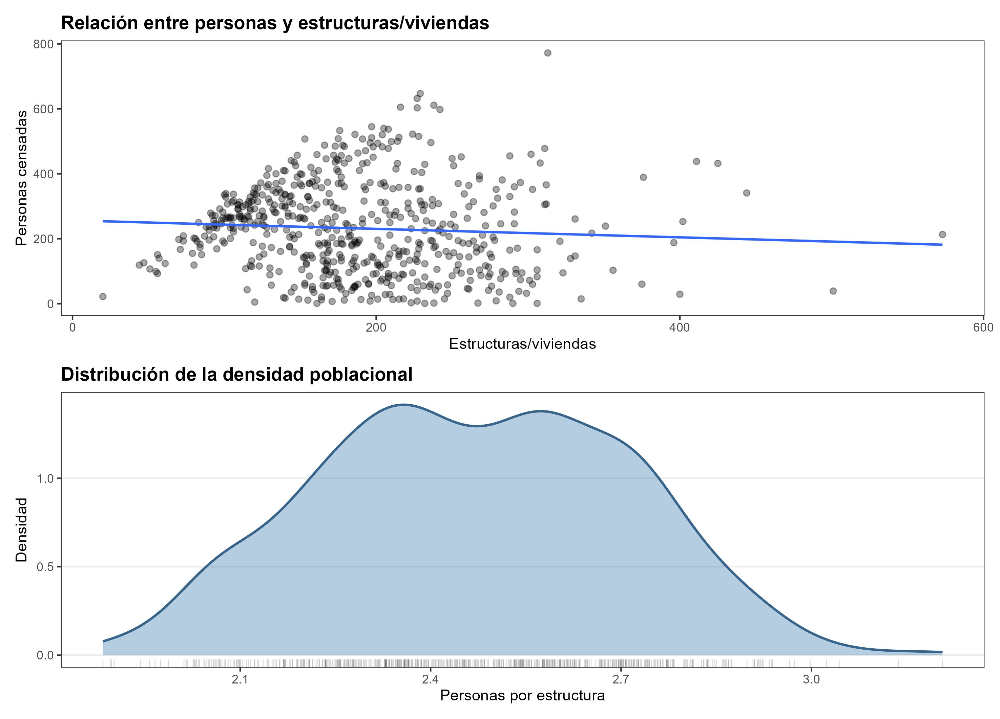
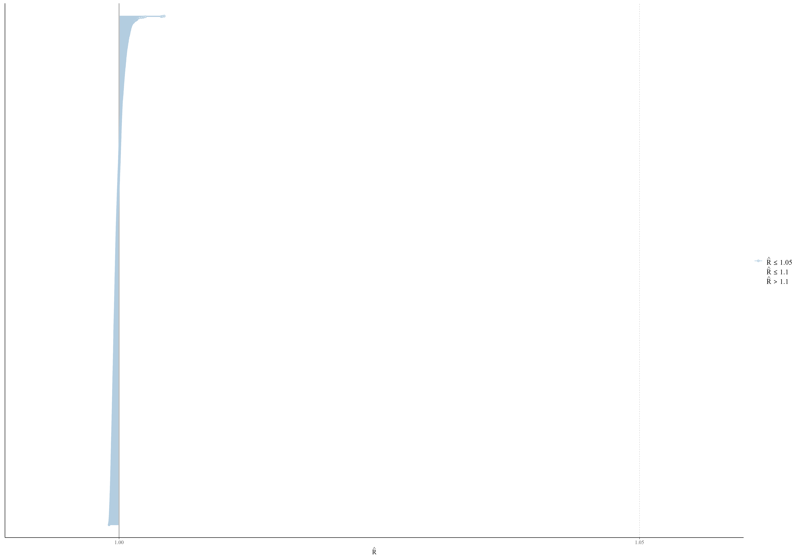
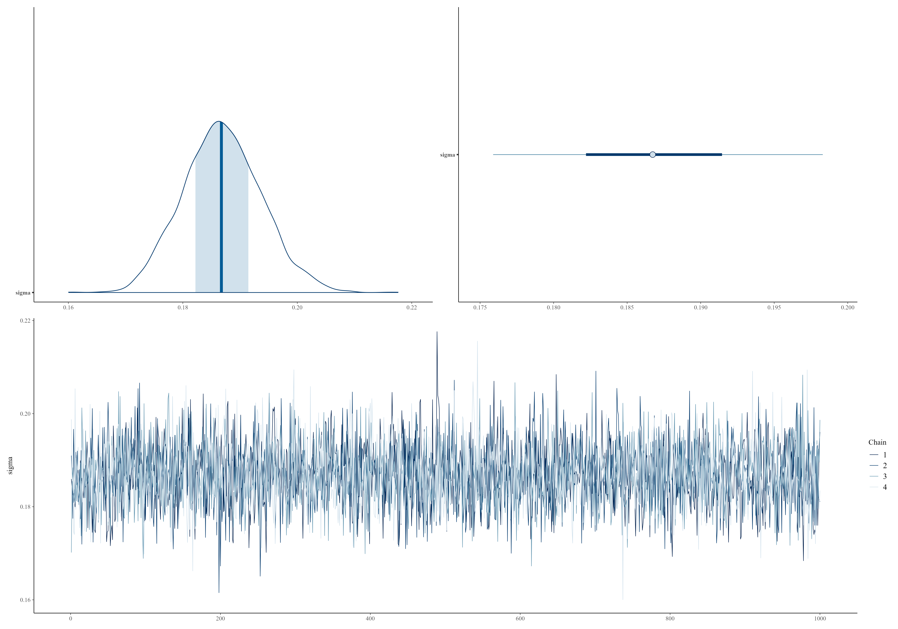
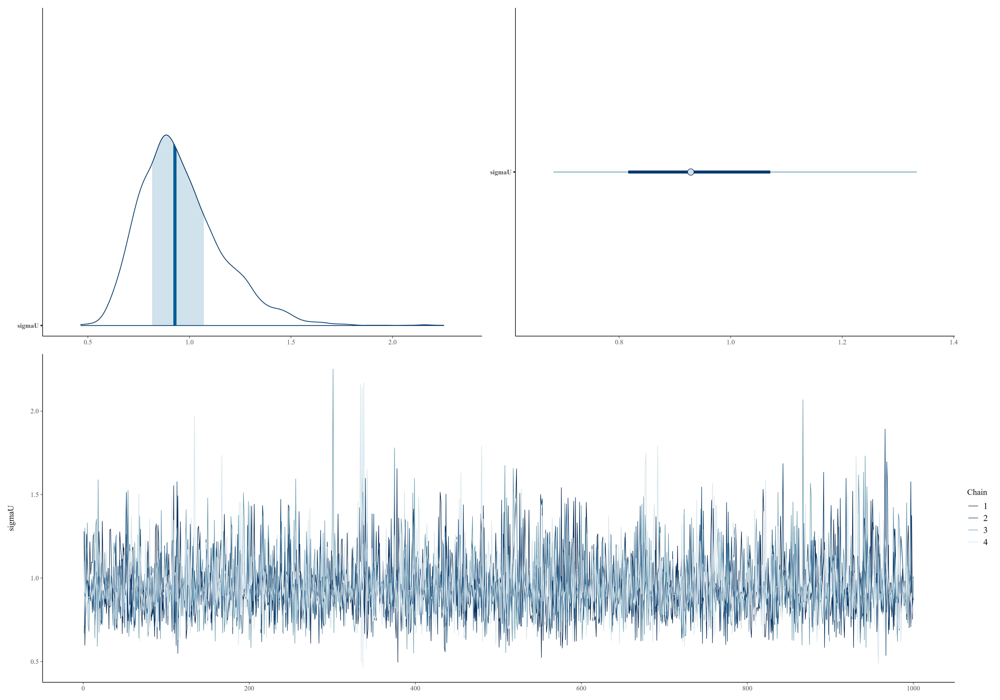
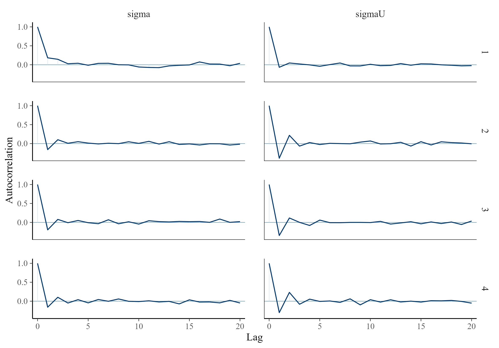
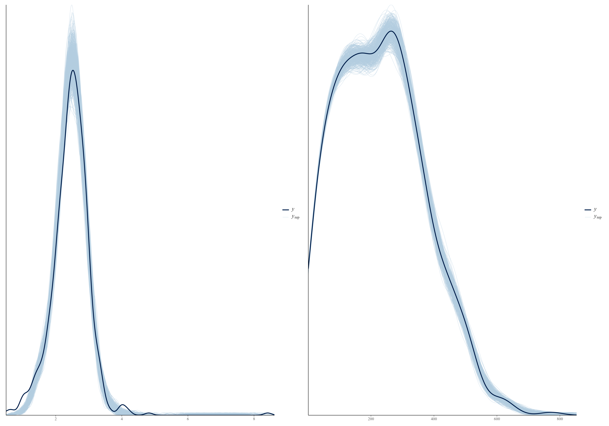

## Aplicación con datos reales {#aplicacion-datos-reales}

En esta sección se presenta la aplicación completa del modelo Poisson-lognormal a datos censales reales. El objetivo es mostrar, de manera integrada, las principales etapas del análisis: caracterización de los datos, evaluación de la convergencia, verificación predictiva y obtención de las estimaciones de población para las unidades territoriales de interés.

Para preservar la confidencialidad de la información, las unidades territoriales se presentan mediante códigos anónimos y no se identifica el país de procedencia de los datos.

### Datos utilizados en la aplicación

La aplicación utiliza información agregada a nivel de la unidad censal mínima, correspondiente a segmentos de enumeración. Para cada unidad se dispone del conteo de personas registrado por el censo, el número de estructuras o viviendas, el porcentaje de cobertura alcanzado durante el operativo censal y la densidad poblacional derivada de estas variables.

El conteo censal presenta valores faltantes en las unidades que no fueron cubiertas por el operativo, que constituyen precisamente el ámbito en el que se requiere la estimación modelada. El número de estructuras se incorpora como información auxiliar y como exposición del modelo, mientras que la densidad poblacional constituye la cantidad que se modela y posteriormente se utiliza para obtener los conteos poblacionales predichos.

La Tabla \@ref(tab:ejemplo-descriptivo) resume las principales variables disponibles antes del ajuste del modelo.

<table class="table" style="width: auto !important; margin-left: auto; margin-right: auto;">
<caption>(\#tab:ejemplo-descriptivo)Estadísticas descriptivas de la base de entrada por unidad censal, antes del ajuste del modelo.</caption>
 <thead>
  <tr>
   <th style="text-align:center;"> Descriptivo </th>
   <th style="text-align:center;"> Resultado </th>
  </tr>
 </thead>
<tbody>
  <tr>
   <td style="text-align:center;"> N.º de unidades censales </td>
   <td style="text-align:center;"> 609.0 </td>
  </tr>
  <tr>
   <td style="text-align:center;"> N.º de unidades territoriales agregadas </td>
   <td style="text-align:center;"> 11.0 </td>
  </tr>
  <tr>
   <td style="text-align:center;"> Cobertura censal completa (%) </td>
   <td style="text-align:center;"> 21.7 </td>
  </tr>
  <tr>
   <td style="text-align:center;"> Mediana conteo censal </td>
   <td style="text-align:center;"> 229.0 </td>
  </tr>
  <tr>
   <td style="text-align:center;"> Mediana estructuras/viviendas </td>
   <td style="text-align:center;"> 181.0 </td>
  </tr>
  <tr>
   <td style="text-align:center;"> Densidad media (personas/estructura) </td>
   <td style="text-align:center;"> 2.5 </td>
  </tr>
</tbody>
</table>

La Figura \@ref(fig:ejemplo-densidad-insumo) resume la base de entrada en dos paneles: arriba, la relación entre el número de estructuras/viviendas y las personas censadas por unidad censal, con su recta de tendencia; abajo, la densidad de la densidad poblacional por unidad censal, $\delta_i$, la magnitud que el modelo Poisson-lognormal busca reproducir.

(\#fig:ejemplo-densidad-insumo)Relación entre estructuras/viviendas y personas censadas (arriba) y densidad (kernel) de la densidad poblacional por unidad censal (abajo), en la base de entrada.

Ambos paneles muestran una relación heterogénea entre el número de personas censadas y las estructuras o viviendas. En el panel superior se observa que, para un mismo número de estructuras, el número de personas censadas puede variar considerablemente. Esta dispersión aumenta especialmente en las unidades con mayor número de estructuras, por lo que el número de estructuras aporta información sobre el tamaño poblacional, pero no determina por sí solo la población de cada unidad.

El panel inferior muestra la distribución de personas por estructura. La mayor concentración se encuentra aproximadamente entre 2,2 y 2,8 personas por estructura, aunque se observan diferencias importantes entre las unidades y una cola hacia valores superiores a 3 personas por estructura. La distribución presenta además más de una zona de concentración, lo que evidencia heterogeneidad en la relación entre estructuras y población.

En conjunto, los resultados muestran que no es adecuado asumir una razón fija de personas por estructura para todas las unidades censales. Esta heterogeneidad respalda la especificación del modelo en términos de una densidad poblacional específica para cada unidad, de modo que el número de estructuras aporte información sobre la exposición, mientras que la densidad permita representar las diferencias en el tamaño poblacional entre unidades con características estructurales similares.

### Especificación utilizada en el ajuste

El ajuste analizado en esta sección corresponde al modelo Poisson-lognormal presentado en el Capítulo \@ref(cap-conteos), aplicado a las unidades censales disponibles en los datos. La estructura del modelo mantiene la formulación general de la Sección \@ref(definicion-formal): los conteos observados se modelan mediante una distribución Poisson cuya intensidad depende de la densidad poblacional y del número de estructuras —el offset descrito en la Sección \@ref(sobredispersion-offset)—, mientras que la densidad se relaciona con las covariables mediante un modelo log-normal con efectos fijos y aleatorios.

La implementación utilizada para este ajuste distingue entre las unidades con información censal observada y el conjunto completo de unidades sobre las que se realizan las predicciones, tal como describe el bloque `data` del programa Stan en la Sección \@ref(stan-implementacion). El modelo se estima utilizando los segmentos observados y, una vez obtenidas las muestras posteriores, genera para todas las unidades una distribución predictiva de la densidad y un conteo poblacional asociado, siguiendo el mecanismo descrito en la Sección \@ref(distribucion-posterior). Esta estructura permite obtener estimaciones para las unidades que no cuentan con un conteo censal observado.

Las distribuciones previas utilizadas corresponden a las especificadas en la Sección \@ref(distribuciones-previas) y codificadas en el Código \@ref(exr:cod-stan-poisson-lognormal), con $\tau_\beta^2=100$ para los coeficientes de efectos fijos, $\tau_U^2=1$ para la escala de los efectos aleatorios y $\tau_\sigma=2{,}5$ para la distribución previa de la desviación estándar del componente log-normal. Las restricciones de positividad se mantienen para $\sigma$, $\sigma_U$ y las densidades poblacionales.

Una particularidad de la implementación utilizada en este ajuste se encuentra en el cálculo de la intensidad Poisson. Tanto para las unidades observadas como para las predicciones, esta cantidad se acota inferiormente en uno y superiormente en diez millones —el mismo resguardo numérico señalado en la Sección \@ref(stan-implementacion) a propósito de `fmin(fmax(1, ...), 10000000)`, que no debe confundirse con la restricción demográfica $\delta_{\max}$ de la Sección \@ref(sobredispersion-offset)—. Este límite es puramente numérico y no modifica la formulación conceptual del modelo.

En el bloque de cantidades generadas se obtiene, para cada muestra posterior, una realización de la densidad predictiva para todas las unidades y, a partir de ella, una realización del conteo poblacional, reproduciendo la distribución predictiva posterior descrita en la Sección \@ref(distribucion-posterior). La colección de estas realizaciones es la base sobre la que se construyen, más adelante en este capítulo, las estimaciones puntuales de la Sección \@ref(estimaciones-segmento-censal), sus intervalos de credibilidad y las agregaciones territoriales.

El ajuste conserva además la log-verosimilitud puntual para las unidades observadas, tal como declara el vector `log_lik` del Código \@ref(exr:cod-stan-generated-quantities). Esta cantidad no interviene en la estimación del modelo, pero permite realizar posteriormente las evaluaciones basadas en los criterios LOO y WAIC del Código \@ref(exr:cod-loo-waic). Más adelante en esta sección se indica si estas medidas pueden calcularse a partir de las salidas disponibles para este ajuste.

### Diagnóstico de convergencia con salidas reales

El ajuste comprende 3623 parámetros y cantidades derivadas, para los cuales se evaluaron los diagnósticos de convergencia. Los valores de $\hat{R}$ se concentran muy próximos a 1, lo que indica que, para la gran mayoría de las cantidades monitorizadas, las cadenas convergieron hacia distribuciones posteriores consistentes. La Figura \@ref(fig:ejemplo-rhat-hist) muestra esta concentración y permite identificar un valor claramente alejado del conjunto principal, con un $\hat{R}$ cercano a 1,04. Este resultado supera el umbral de 1,01 utilizado como referencia y señala una posible falta de convergencia que debe ser examinada antes de utilizar el ajuste para producir estimaciones finales.

El tamaño efectivo de muestra se situó entre 1.198 y aproximadamente 10.898, con una mediana de 4.526. Estos valores indican que, a pesar de la autocorrelación inherente a las cadenas de MCMC, se dispone de un número considerable de muestras efectivas para la mayoría de las cantidades. No obstante, el diagnóstico de convergencia debe evaluarse conjuntamente con el tamaño efectivo, ya que un número elevado de muestras efectivas no compensa por sí solo una falta de convergencia entre cadenas.

En conjunto, la inspección de $\hat{R}$ y del tamaño efectivo proporciona evidencia sobre la calidad del muestreo y permite identificar las cantidades que requieren una revisión adicional. El valor atípico observado en $\hat{R}$ merece especial atención, por lo que en la siguiente etapa se examinan las cadenas correspondientes para determinar si se trata de una inestabilidad localizada o de un problema que compromete el ajuste completo.

(\#fig:ejemplo-rhat-hist)Estadístico Rhat de todos los parámetros y cantidades generadas de un ajuste real.

Las muestras posteriores de los parámetros estructurales permiten complementar el diagnóstico global de convergencia mediante la inspección de las cadenas y de su autocorrelación. Las Figuras \@ref(fig:ejemplo-trace-sigma) y \@ref(fig:ejemplo-trace-sigmaU) muestran la distribución posterior, los intervalos de credibilidad y las trazas de $\sigma$ y $\sigma_U$ para las cuatro cadenas del ajuste.

(\#fig:ejemplo-trace-sigma)Densidad, intervalo y traza posterior de sigma sobre las cuatro cadenas de un ajuste real.

En el caso de $\sigma$, las cuatro cadenas presentan una superposición estrecha y estable a lo largo de las iteraciones, sin tendencias sistemáticas ni cambios persistentes en su nivel. La distribución posterior se concentra alrededor de 0,19 y presenta una dispersión relativamente reducida. El comportamiento de $\sigma_U$ es similar en términos de mezcla entre cadenas, aunque su distribución posterior muestra una mayor dispersión y una asimetría hacia valores altos. En ambos casos, las trazas oscilan alrededor de un nivel estable durante todo el proceso de muestreo, sin evidencia visual de deriva o separación entre cadenas.

(\#fig:ejemplo-trace-sigmaU)Densidad, intervalo y traza posterior de sigmaU sobre las cuatro cadenas de un ajuste real.

La autocorrelación proporciona información complementaria sobre la dependencia entre muestras consecutivas. La Figura \@ref(fig:ejemplo-acf) muestra que ambos parámetros presentan una autocorrelación elevada en los primeros rezagos, característica esperable en cadenas obtenidas mediante MCMC, pero esta disminuye rápidamente y se aproxima a cero después de los primeros rezagos. No se observan patrones persistentes de autocorrelación a lo largo de la cadena.

(\#fig:ejemplo-acf)Autocorrelación de sigma y sigmaU sobre las cuatro cadenas de un ajuste real, calculada sobre las muestras posteriores guardadas.

En conjunto, los diagnósticos basados en $\hat{R}$, las trazas y la autocorrelación proporcionan evidencia consistente con una adecuada convergencia y mezcla de las cadenas para los parámetros examinados. Esta evaluación debe interpretarse conjuntamente con los tamaños efectivos de muestra reportados anteriormente, ya que la convergencia de las cadenas y la cantidad de información efectiva son aspectos complementarios de la calidad del muestreo.

### Verificación predictiva posterior con datos reales

Una vez evaluada la convergencia de las cadenas, el siguiente paso consiste en verificar si el modelo reproduce adecuadamente las principales características de los datos observados. La verificación predictiva posterior compara la distribución de los datos observados con las distribuciones obtenidas a partir de réplicas generadas bajo el modelo ajustado. La Figura \@ref(fig:ejemplo-ppc-densidad) presenta esta comparación para la densidad poblacional y para los conteos de personas censadas.

(\#fig:ejemplo-ppc-densidad)Verificación predictiva posterior de la densidad (izquierda) y de los conteos brutos (derecha), salida real del Código de verificación predictiva posterior sobre un ajuste efectivo.

En el panel izquierdo, correspondiente a la densidad poblacional, las réplicas posteriores reproducen de manera estrecha la distribución observada. El modelo captura la concentración principal de las unidades, así como su dispersión y el comportamiento de las colas. La distribución observada se encuentra dentro del conjunto de distribuciones predictivas a lo largo de prácticamente todo su recorrido, sin evidenciar diferencias sistemáticas en su localización o amplitud.

En el panel derecho, correspondiente a los conteos poblacionales, se observa un comportamiento similar. Las réplicas posteriores reproducen la forma general de la distribución observada, incluyendo su concentración en el intervalo central y la disminución progresiva de la frecuencia hacia valores altos. La variabilidad entre las réplicas aumenta en las regiones menos densas de la distribución, reflejando una mayor incertidumbre predictiva, pero la distribución observada permanece contenida dentro del patrón generado por el modelo.

En conjunto, la comparación muestra que el modelo Poisson-lognormal reproduce las principales características marginales de los datos observados, tanto en términos de localización como de dispersión y comportamiento de las colas. No se observan discrepancias sistemáticas entre las distribuciones observada y predictiva que indiquen una falta de ajuste evidente para las cantidades evaluadas. Esta evidencia complementa los diagnósticos de convergencia y proporciona respaldo empírico para utilizar el modelo en la generación de predicciones para las unidades censales sin observación.

### Criterios LOO y WAIC

Los criterios LOO-CV y WAIC permiten evaluar el desempeño predictivo de un modelo a partir de la log-verosimilitud puntual de las observaciones en las muestras posteriores. En este caso, se realizó un reajuste del modelo utilizando la misma información y especificación empleadas en la aplicación, incorporando únicamente el cálculo de la log-verosimilitud puntual necesario para obtener estos criterios.

La Tabla \@ref(tab:ejemplo-loo-waic) presenta los resultados obtenidos. El valor estimado de la log-verosimilitud predictiva acumulada es de $-2679,3$ para LOO-CV y de $-2554,7$ para WAIC. Los respectivos errores estándar son 19,8 y 17,2. Las estimaciones del número efectivo de parámetros son 412,9 para LOO-CV y 288,2 para WAIC.

Estos valores deben interpretarse con cautela. LOO-CV y WAIC son criterios de comparación predictiva y su utilidad principal se encuentra en comparar especificaciones alternativas del modelo mediante el mismo criterio; por sí solos, sus valores absolutos no permiten establecer que un modelo sea adecuado. En particular, la calidad de la aproximación utilizada para calcular estos criterios debe evaluarse mediante sus diagnósticos específicos.

<table class="table" style="width: auto !important; margin-left: auto; margin-right: auto;">
<caption>(\#tab:ejemplo-loo-waic)Criterios LOO-CV y WAIC calculados sobre un reajuste del modelo.</caption>
 <thead>
  <tr>
   <th style="text-align:center;"> Criterio </th>
   <th style="text-align:center;"> elpd </th>
   <th style="text-align:center;"> SE(elpd) </th>
   <th style="text-align:center;"> p_efectivo </th>
   <th style="text-align:center;"> SE(p_efectivo) </th>
   <th style="text-align:center;"> Criterio (waic/looic) </th>
   <th style="text-align:center;"> SE </th>
  </tr>
 </thead>
<tbody>
  <tr>
   <td style="text-align:center;"> WAIC </td>
   <td style="text-align:center;"> -2554.7 </td>
   <td style="text-align:center;"> 17.2 </td>
   <td style="text-align:center;"> 288.2 </td>
   <td style="text-align:center;"> 9.3 </td>
   <td style="text-align:center;"> 5109.3 </td>
   <td style="text-align:center;"> 34.5 </td>
  </tr>
  <tr>
   <td style="text-align:center;"> LOO-CV </td>
   <td style="text-align:center;"> -2679.3 </td>
   <td style="text-align:center;"> 19.8 </td>
   <td style="text-align:center;"> 412.9 </td>
   <td style="text-align:center;"> 12.0 </td>
   <td style="text-align:center;"> 5358.7 </td>
   <td style="text-align:center;"> 39.7 </td>
  </tr>
</tbody>
</table>

La Tabla \@ref(tab:ejemplo-pareto-k) muestra la distribución de los valores Pareto-$k$ asociados a la aproximación PSIS-LOO. Solo 184 de las 588 unidades censales observadas (31,3 %) presentan valores considerados buenos ($k\leq0,7$). Otras 322 unidades (54,8 %) se encuentran en el intervalo $0,7<k\leq1$, mientras que 82 unidades (13,9 %) presentan valores superiores a 1. En consecuencia, aproximadamente dos terceras partes de las observaciones presentan valores de $k$ que indican una aproximación potencialmente inestable.

<table class="table" style="width: auto !important; margin-left: auto; margin-right: auto;">
<caption>(\#tab:ejemplo-pareto-k)Distribución de los diagnósticos Pareto-k de PSIS-LOO sobre las unidades censales observadas.</caption>
 <thead>
  <tr>
   <th style="text-align:center;"> Categoria </th>
   <th style="text-align:center;"> N.º de observaciones </th>
   <th style="text-align:center;"> Porcentaje </th>
  </tr>
 </thead>
<tbody>
  <tr>
   <td style="text-align:center;"> Bueno (k &lt;= 0,7) </td>
   <td style="text-align:center;"> 184 </td>
   <td style="text-align:center;"> 31.3 </td>
  </tr>
  <tr>
   <td style="text-align:center;"> Malo (0,7 &lt; k &lt;= 1) </td>
   <td style="text-align:center;"> 322 </td>
   <td style="text-align:center;"> 54.8 </td>
  </tr>
  <tr>
   <td style="text-align:center;"> Muy malo (k &gt; 1) </td>
   <td style="text-align:center;"> 82 </td>
   <td style="text-align:center;"> 13.9 </td>
  </tr>
</tbody>
</table>

Esta situación limita la interpretación de los resultados de LOO-CV y WAIC para este ajuste. La presencia de numerosos valores elevados de Pareto-$k$ indica que las aproximaciones basadas en importancia pueden ser poco fiables para una proporción importante de las unidades observadas. Por tanto, los valores reportados no deben utilizarse como evidencia concluyente para seleccionar esta especificación frente a otras.

Esta limitación no debe confundirse con un problema de convergencia. Los diagnósticos examinados en las secciones anteriores muestran un comportamiento adecuado de las cadenas, mientras que los valores de Pareto-$k$ evalúan la estabilidad de la aproximación utilizada para la validación predictiva. Se trata, por tanto, de dos aspectos diferentes del análisis.

Una posible explicación de esta dificultad está relacionada con la estructura del modelo. La presencia de una densidad poblacional específica para cada unidad observada introduce un gran número de parámetros latentes en relación con el número de observaciones. Esta característica puede hacer que la eliminación de una observación tenga una influencia importante sobre la distribución posterior y, en consecuencia, dificulte la aproximación de validación cruzada basada en PSIS-LOO.

En consecuencia, los resultados de LOO-CV y WAIC se presentan aquí como información complementaria sobre el comportamiento predictivo del ajuste, pero no como un criterio concluyente de selección de modelos. Cuando se requiera comparar de manera robusta especificaciones alternativas para este tipo de modelos, una alternativa es realizar una validación cruzada explícita mediante particiones de los datos, evaluando el desempeño predictivo de cada especificación sobre observaciones no utilizadas en su ajuste.

### Estimaciones y agregación territorial

Una vez evaluada la convergencia y la capacidad predictiva del modelo, las muestras posteriores permiten obtener estimaciones de población para cada unidad censal y agregarlas posteriormente a niveles territoriales superiores, siguiendo el procedimiento general de la Sección \@ref(estimaciones-segmento-censal). En esta aplicación, la estimación final combina la información censal disponible con las predicciones del modelo de acuerdo con el nivel de cobertura alcanzado en cada unidad.

La cobertura censal permite distinguir las tres situaciones de la clasificación de segmentos de la Sección \@ref(clasificacion-segmentos). Cuando la cobertura es completa, se conserva el conteo observado por el censo. Cuando la cobertura es nula, la estimación se obtiene a partir de la predicción del modelo. Para las unidades con cobertura parcial, se utiliza el mayor entre el conteo censal observado y la predicción del modelo —la misma regla de dominancia que el Código \@ref(exr:cod-regla-cobertura) aplica muestra por muestra, no solo sobre la estimación puntual—. De esta manera, la estimación final conserva la información efectivamente observada y utiliza el modelo para completar la población que no pudo ser registrada durante el operativo.

La Tabla \@ref(tab:ejemplo-totales) aplica esta corrección agregada a nivel nacional, siguiendo el mismo procedimiento de suma por muestra del Código \@ref(exr:cod-agregacion-nacional).

<table class="table" style="width: auto !important; margin-left: auto; margin-right: auto;">
<caption>(\#tab:ejemplo-totales)Comparación entre el conteo censal y la estimación final del modelo (ya corregida por estado de cobertura), agregados a nivel nacional.</caption>
 <thead>
  <tr>
   <th style="text-align:center;"> N.º de unidades </th>
   <th style="text-align:center;"> N.º con cobertura completa </th>
   <th style="text-align:center;"> Total censal </th>
   <th style="text-align:center;"> Total final (media) </th>
   <th style="text-align:center;"> Total final (mediana) </th>
  </tr>
 </thead>
<tbody>
  <tr>
   <td style="text-align:center;"> 609 </td>
   <td style="text-align:center;"> 132 </td>
   <td style="text-align:center;"> 136349 </td>
   <td style="text-align:center;"> 282154 </td>
   <td style="text-align:center;"> 278137 </td>
  </tr>
</tbody>
</table>

La Tabla \@ref(tab:ejemplo-totales) muestra una diferencia importante entre el conteo censal y la estimación final. De las 609 unidades censales consideradas, únicamente 132 presentan cobertura completa. El conteo censal registra 136.349 personas, mientras que la estimación final alcanza 282.154 personas cuando se utiliza la media posterior y 278.137 cuando se utiliza la mediana.

Esta diferencia refleja el efecto de las unidades cuya cobertura fue nula o parcial y que, por tanto, requieren información predictiva para completar la estimación. La magnitud de la diferencia también muestra que, en esta aplicación, una parte sustancial de la población estimada depende de la información proporcionada por el modelo y no únicamente de los conteos observados durante el operativo censal.

La proximidad entre las estimaciones obtenidas mediante la media y la mediana posteriores constituye además un resultado relevante. La diferencia entre ambas es de aproximadamente 4.000 personas a nivel agregado, lo que representa una diferencia relativamente pequeña frente al total estimado. Esto indica que, pese a la posible asimetría de las distribuciones predictivas a nivel de unidad, esta no genera una discrepancia importante entre ambas medidas de tendencia central cuando se agregan los resultados.

La estimación final puede agregarse posteriormente a unidades territoriales de mayor nivel, siguiendo el procedimiento del Código \@ref(exr:cod-agregacion-dam). La Tabla \@ref(tab:ejemplo-agregacion) presenta los resultados para las unidades territoriales consideradas en esta aplicación.

<table class="table" style="width: auto !important; margin-left: auto; margin-right: auto;">
<caption>(\#tab:ejemplo-agregacion)Estimación final de población (ya corregida por estado de cobertura) agregada a la unidad territorial de nivel superior.</caption>
 <thead>
  <tr>
   <th style="text-align:center;"> Unidad territorial </th>
   <th style="text-align:center;"> N.º de unidades </th>
   <th style="text-align:center;"> Total censal </th>
   <th style="text-align:center;"> Total final (media) </th>
   <th style="text-align:center;"> Densidad media </th>
  </tr>
 </thead>
<tbody>
  <tr>
   <td style="text-align:center;"> Unidad 1 </td>
   <td style="text-align:center;"> 174 </td>
   <td style="text-align:center;"> 42193 </td>
   <td style="text-align:center;"> 76965.7 </td>
   <td style="text-align:center;"> 2.6 </td>
  </tr>
  <tr>
   <td style="text-align:center;"> Unidad 2 </td>
   <td style="text-align:center;"> 126 </td>
   <td style="text-align:center;"> 28368 </td>
   <td style="text-align:center;"> 56632.8 </td>
   <td style="text-align:center;"> 2.2 </td>
  </tr>
  <tr>
   <td style="text-align:center;"> Unidad 3 </td>
   <td style="text-align:center;"> 65 </td>
   <td style="text-align:center;"> 18569 </td>
   <td style="text-align:center;"> 29930.2 </td>
   <td style="text-align:center;"> 2.4 </td>
  </tr>
  <tr>
   <td style="text-align:center;"> Unidad 4 </td>
   <td style="text-align:center;"> 64 </td>
   <td style="text-align:center;"> 9046 </td>
   <td style="text-align:center;"> 28185.7 </td>
   <td style="text-align:center;"> 2.2 </td>
  </tr>
  <tr>
   <td style="text-align:center;"> Unidad 5 </td>
   <td style="text-align:center;"> 44 </td>
   <td style="text-align:center;"> 11233 </td>
   <td style="text-align:center;"> 23949.3 </td>
   <td style="text-align:center;"> 2.7 </td>
  </tr>
  <tr>
   <td style="text-align:center;"> Unidad 6 </td>
   <td style="text-align:center;"> 30 </td>
   <td style="text-align:center;"> 5068 </td>
   <td style="text-align:center;"> 16290.6 </td>
   <td style="text-align:center;"> 2.6 </td>
  </tr>
  <tr>
   <td style="text-align:center;"> Unidad 7 </td>
   <td style="text-align:center;"> 29 </td>
   <td style="text-align:center;"> 5892 </td>
   <td style="text-align:center;"> 12973.8 </td>
   <td style="text-align:center;"> 2.5 </td>
  </tr>
  <tr>
   <td style="text-align:center;"> Unidad 8 </td>
   <td style="text-align:center;"> 21 </td>
   <td style="text-align:center;"> 3581 </td>
   <td style="text-align:center;"> 11405.5 </td>
   <td style="text-align:center;"> 2.7 </td>
  </tr>
  <tr>
   <td style="text-align:center;"> Unidad 9 </td>
   <td style="text-align:center;"> 24 </td>
   <td style="text-align:center;"> 4917 </td>
   <td style="text-align:center;"> 10682.8 </td>
   <td style="text-align:center;"> 2.7 </td>
  </tr>
  <tr>
   <td style="text-align:center;"> Unidad 10 </td>
   <td style="text-align:center;"> 21 </td>
   <td style="text-align:center;"> 5539 </td>
   <td style="text-align:center;"> 9770.7 </td>
   <td style="text-align:center;"> 2.7 </td>
  </tr>
  <tr>
   <td style="text-align:center;"> Unidad 11 </td>
   <td style="text-align:center;"> 11 </td>
   <td style="text-align:center;"> 1943 </td>
   <td style="text-align:center;"> 5367.1 </td>
   <td style="text-align:center;"> 2.7 </td>
  </tr>
</tbody>
</table>

La agregación territorial permite apreciar diferencias importantes tanto en el tamaño de la población como en la magnitud de la corrección respecto del conteo censal. La Unidad 1, por ejemplo, pasa de 42.193 personas censadas a una estimación final de 76.965,7, mientras que la Unidad 4 pasa de 9.046 a 28.185,7 personas. Estas diferencias reflejan la combinación del tamaño de las unidades, el nivel de cobertura alcanzado durante el operativo y las características de las unidades censales que componen cada territorio.

El resultado muestra la utilidad de realizar la estimación en la unidad censal mínima antes de efectuar las agregaciones territoriales. Las predicciones se obtienen para cada unidad a partir de sus características y de la estructura jerárquica del modelo y, posteriormente, pueden sumarse para construir estimaciones correspondientes a unidades territoriales de mayor nivel. Este procedimiento permite conservar la heterogeneidad existente entre las unidades censales y evita que la corrección de cobertura se realice únicamente sobre agregados territoriales, preservando la propiedad de coherencia por agregación descrita en la Sección \@ref(cap-inferencia): al provenir todos los niveles geográficos de las mismas muestras posteriores por segmento, los totales de distintos niveles son automáticamente consistentes entre sí, sin un paso adicional de conciliación.

En conjunto, la aplicación muestra el recorrido completo desde las observaciones censales y la información auxiliar hasta una estimación de población corregida por cobertura y agregada territorialmente. El modelo no sustituye la información censal disponible: la complementa allí donde el operativo no proporciona una cobertura suficiente, utilizando la distribución predictiva posterior para recuperar la población correspondiente a las unidades con información incompleta o ausente.

